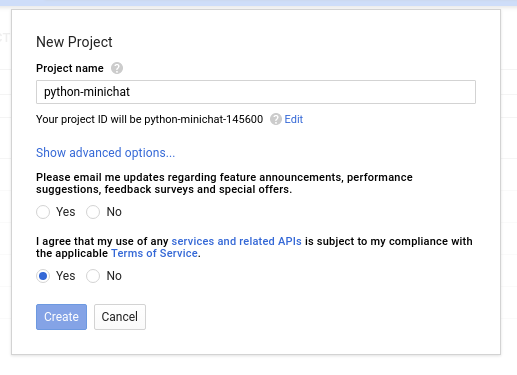

# A simple chat room for App Engine

First project for Scripted Studio at Google!

Check out the example here: TODO add link

## Instructions

1.  Go to <https://console.cloud.google.com> sign in and click on CREATE PROJECT

    

1.  Choose a project name for your project.

    

1.  Clone this repo and open the folder in Eclipse. Note if Eclipse isn't
    installed or configured for App Engine see [instructions here]
    (https://cloud.google.com/appengine/docs/python/tools/setting-up-eclipse)

1.  Click the **Deploy App Engine Project** button in the toolbar. Enter to
    project name you create previously. 

1.  Once your project is deployed open it up in a browser by going to
    your-project-name.appspot.com

## Code Walk-through

There are two files with code for this project and one config file. Let's walk
through them to see what they are doing to make the application work.


### [`main.py`](main.py)

The main python file, `main.py`, consists of four handlers for different
actions. Each handler is bound to a url at the end of the file when the
application is defined:

```py
app = webapp2.WSGIApplication([
  ('/', HandleMain),
  ('/send', HandleSend),
  ('/_ah/channel/connected/', HandleConnect),
  ('/_ah/channel/disconnected/', HandleDisconnect),
], debug=True)
```

`HandleMain` is the first entry point to the application. This handler is called
when the web page is loaded and it returns the `index.html` file to the browser.

The first thing it does is save the user loading the page to the database and
open a channel for that user.

```py
class HandleMain(webapp2.RequestHandler):
  """ Renders index.html an initializes the chat room channel. """
  @login_required
  def get(self):
    user = users.get_current_user()
    chat_user = ChatUser.get_or_insert(user.user_id(),
                                       nickname = user.nickname())

    token = channel.create_channel(chat_user.key.string_id())
    template = jinja_environment.get_template('index.html')
    self.response.out.write(template.render({ 'token': token }))
```

`HandleSend` is called when the javascript application on the frontend send a
new chat message to the backend. Once it receives the message it then sends out
that message to each connected user.

```py
class HandleSend(webapp2.RequestHandler):
  """ When a user sends a message to be echoed to all other users. """
  def post(self):
    user_id = users.get_current_user().user_id()
    chat_user = ChatUser.get_by_id(user_id)

    data = self.request.get('data')
    for recipient in ChatUser.query():
      channel.send_message(recipient.key.string_id(),
                           '%s: %s' % (chat_user.nickname, cgi.escape(data)))
```

`HandleConnect` is called when the channel for a new user is ready to be used.
Similar to `HandleSend` it also broadcasts out to every user that a new user has
joined the chat room.

```py
class HandleConnect(webapp2.RequestHandler):
  """ Send a welcome message and notifies all other users. """
  def post(self):
    user_id = self.request.get('from')
    chat_user = ChatUser.get_by_id(user_id)

    existing_users = ChatUser.query(ChatUser.key != chat_user.key)
    channel.send_message(chat_user.key.string_id(),
                         'Welcome, %s! Other chatters: %d' %
                         (chat_user.nickname, existing_users.count()))
    for existing_user in existing_users:
      channel.send_message(existing_user.key.string_id(),
                           '%s joined' % chat_user.nickname)
```

`HandleDisconnect` is called when a user closes the web page. It deletes the
user from the database so the application doesn't try to send messages to the
user anymore. And it also broadcasts the exit out.

```py
class HandleDisconnect(webapp2.RequestHandler):
  """ Deletes the user model and notifies all other users. """
  def post(self):
    user_id = self.request.get('from')
    chat_user = ChatUser.get_by_id(user_id)
    chat_user.key.delete()

    for user in ChatUser.query():
      channel.send_message(user.key.string_id(), '%s left' % chat_user.nickname)
```

Finally the users are stored in the database in the format described by the
`ChatUser` class. And this class is used to save, delete, and query users.

```py
class ChatUser(ndb.Model):
  """ Stored user model. Should be keyed by the User ID. """
  nickname = ndb.StringProperty()
```

### [`index.html`](index.html)

The `index.html` file has both the html and javascript in it. First the html
consists of a `div` to contain the chat messages and an `input` tag where user
sends chat messages.

```html
<div id="chat">
  <div id="messages"></div>
  <input disabled placeholder="Connecting..." id="newmessage"></input>
</div>
```

Next the html imports jQuery and the api for App Engine channels.

```html
<script src='//ajax.googleapis.com/ajax/libs/jquery/3.1.1/jquery.min.js'>
</script>
<script src='/_ah/channel/jsapi'></script>
```

In the application javascript we start off by saving the jQuery objects for the
two html elements from above.

```html
<script>
  var messages = $('#messages');
  var newmessage = $('#newmessage');
```

Then we use the library imported from `/_ah/channel/jsapi` to open a channel to
the backend. Note here the value `{{ token }}` is replaced when the `index.html`
is served with the unique token string created in `main.py`.

```js
  // Wire up the channel event handlers.
  var channel = new goog.appengine.Channel('{{ token }}');
  var handler = {
    'onopen': function() {
      // Let the chatting begin.
      newmessage.attr('placeholder', 'Send a message');
      newmessage.attr('disabled', false);
      newmessage.focus();
    },
    'onmessage': function(m) {
      // Blindly append the message to the end of the element.
      messages.append('<p class="message">' + m.data + '</p>');
    },
    'onerror': function() {}, // No-op.
    'onclose': function() {}, // No-op.
  };
channel.open(handler);
```

Finally, we listen for the user pressing enter on the chat input and send the
chat message. We also bind to the user clicking outside of the chat input and
return focus to it in order to make sure it's always easy to send a new chat
message.

```js
// Enter-button handler, i.e. send a message.
newmessage.on('keypress', function(e) {
  if (e.key === 'Enter' && newmessage.val() !== '') {
    $.post('/send', {data: newmessage.val()});
    newmessage.val('');
  };
});

// Force all focus to the input box.
newmessage.on('blur', function(e) {
  newmessage.focus();
});
```

### [`app.yaml`](app.yaml)

The `app.yaml` file is a config file that App Engine uses to run the application
when it's deployed. The first three lines of the file set up the project to run
a python backend.

```yaml
runtime: python27
api_version: 1
threadsafe: true
```

The next section of the file connects the urls to the `main.py` file.
`inbound_services` sets up the internal `/_ah/channel/` urls for receiving
the connect and disconnect notifications.

```yaml
inbound_services:
- channel_presence

handlers:
- url: /.*
  script: main.app
````

Finally, App Engine needs to know about the third party libaries our python
application uses.

```yaml
libraries:
- name: webapp2
  version: "2.5.2"
- name: jinja2
  version: "2.6"
```
